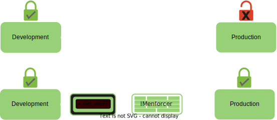

# WEED - What EEs Different  
## Prevent runtime errors in production ahead of time!

Have you ever pushed to production only to find out that the permissions between staging and production environments are out of sync? resulting in access errors in a live environment? Well we have, we got frustrated, learned  and created WEED!!!

## What is WEED?

WEED is a CLI tool that assures permissions are synced between development and production environmentsץ
WEED Checks for permission differences between requested permissions in an environment to current environment.
WEED maps permissions on both environments checking for discrepancies that might cause access errors in production  

### Components 

***WEED CLI***  - 
Discovers Diff in permissions between environments to avoid those pesky 403 erors in production.

***IMenforcer – K8s AWS Admission Controller*** – 
Intercepts API requestes Acts as a validation layer, assuring permissions discrepancies that were discovered by WEED are resolved before pushing to production
 

   

# Prerequisites

 - AWS Account 
 - Role in AWS

## CLI Installation 

